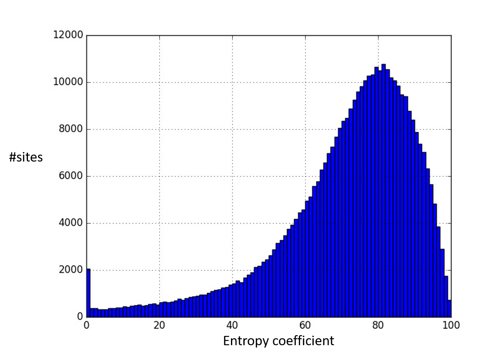
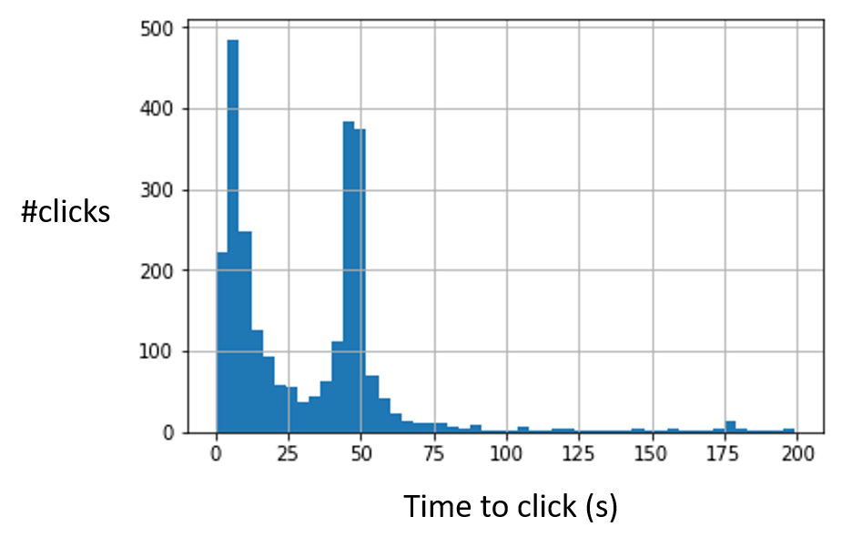

*Fighting ad fraud with data science*

The advertisement industry can be different to other industries in many aspects. Fraud is not one of these aspects. Scammers are everywhere and mobile advertisement is not different. In order to explain where are the fraudsters picking their money from, first we have to understand how do the money flows in the web advertising industry. For the sake of clarity, we will explain it through an scenario with only four actors though in the daily business more actors are participating.

* **Advertiser**: It is the one bringing the money to the industry. They pay to be shown in apps and websites. They may have different KPIs like impressions, clicks or purchases. Regardless the used KPI, they want to show their ads to humans who may be interested on buying their products. Fraudsters do not have interest on buying anything, so they are not the target of their campaigns.
* **DSPs (Adello)**: They run campaigns for advertisers by participating in real time biddings and buying impressions (or clicks, or purchases, etc.) that fulfill a given set of conditions, e.g. location, gender, age, etc. These people do not want to buy fraud. If the advertiser, i.e. customer, realizes that the DSP is buying fraud with their money, the advertiser won't be happy and everybody know what happens when your customer is not happy.
* **Exchanges**: They sell available impressions in sites owned by publishers. The more inventory available they have, the more they can sell to DSPs. Thus, their main interest is to have a decent amount of active traffic on their publisher.
* **Publishers**: They are offering impressions where ads can be shown. For every impression they are able to show, the receive a portion of the money the advertiser paid (you have to subtract DSP and exchanges's margins). The more visitors they have, the more impressions they can sell. Most of the publishers try to increase the amount of visitors by offering quality content, e.g. news, tutorials, videos, etc. However, other publishers may prefer to create this traffic artificially and increase so their incomes. Fraudster are usually hired by publishers and their objective is normally to increase the traffic of the publisher websites in a way that appears to be human traffic.

In Adello we are fighting fraud every day and we know that this is a never ending war. Fraudsters will always find a new way to make their business, so we have to stay alert and proactively research new ways they would try to cheat us. Unlike other kind of frauds like financial fraud, we do not have anyway of building a ground truth, so we work in a unsupervised learning scenario. Next we give more details about some of our fraud detection method.

1. **Site Entropy**: In information theory, the less common (i.e. the lower the probability) is an event to occur, the more information it carries. The more information it carries, the higher the entropy value is. In our context, we define an event as visit of a certain entity, e.g. an IP adress, to a website. If this event is happening more often than the "normal" we may think that there is some suspicious interest/incentive for this IP address to visit this website with an abnormal high frequency in comparison to the rest of websites. In Adello we analyze our incoming traffic and compute an entropy coefficient for each site we have in our inventory. Sites that are always visited by (almost) the same set of IPs receive a low entropy coefficient and sites that are visited by very different IPs receive a high entropy coefficient. Low entropy sites are marked as suspicious and blacklisted. If you want to gain more insights, read this paper from [Pastor Valles](http://eprints.networks.imdea.org/1595/). 

2. **Massive Low Intensity Attack**: This attack is performed by a large army of IPs or devices but in a low intensity way, i.e. without detectable peaks in their activity. Think about IPs that visit a website once a day, but everyday of the year. If this site is our favourite social network or our favourite web search engine it would not be that suspicious. However, if this is happening in not so popular websites, a fraudster may be behind this activity.

3. **Click patterns**: The complexity of click bots has increased over the last years and some of them are able to simulate human-like mouse movements, scrolling, etc. Nevertheless, the old click bots did not retire. They are still active, hoping to slip past. This old bots were not so smart and prefer always to click on certain positions than others or they like to wait a determined amount of seconds before clicking. They may be difficult to detect when also human traffic is visiting the site. The good thing is that sometimes they are the only visitors and then we end up discovering them because of their silly clicking strategy.

Basically what we creating our own version of the [Turing test](https://en.wikipedia.org/wiki/Turing_test). In the classic Turing test a machine pretends to be a human and a human has to decide if she is dealing with another human or a machine. Some experts claim that the Turing test will be passed among 2029 and 2040 [1](http://isturingtestpassed.github.io/). AI experts are aiming this to happen not only because of research reasons, but also because there are fair use cases in which machines with human behavior are desirable, e.g. the [medical chatbots](https://www.techemergence.com/chatbots-for-healthcare-comparison/). Having machines able to imitate human behavior will make our job in fraud detection more challenging. Nevertheless, we have an advantage. Fraud bots won't have to cheat only humans, but also other machines, which from our perspective is much more difficult given the computation power of the machines. For this reason we are not talking here about a pure Turing test.

Hopefully these examples help you to understand how do we use data science in Adello for fighting fraud. However we are not the only department of the company aiming to imporve the quality of the traffic we bought. For example, we update also continuosly a white list of sites and apps where brand safety is ensured and where only real sites and apps are included, i.e. dummy sites and apps which only aim to sell advertisement and clearly do not offer any content are excluded from this list. Fraud is a serious problem in our industry and for this reason we have to tackle it from all possible perspectives.

