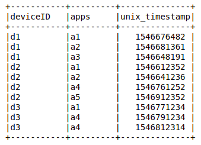
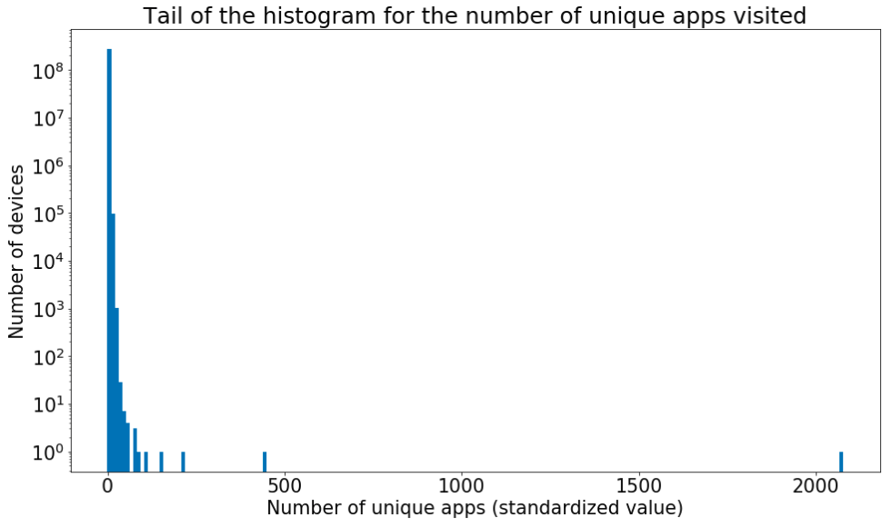

This post describes an example of the quality selection we perform at Adello, underlining the benefits we gain from it.

In a [previous post](https://adello.github.io/Tracking/) we introduced the way we track a person (a smart device) for advertising targeting purpose.
In summary, we use the Android **[Advertising ID](https://support.google.com/googleplay/android-developer/answer/6048248?hl=en)** and the iOS Identifier for Advertisers. 
In the rest of the post we call these random pseudonyms as **deviceID** since we use them as an identifier of a smart device (mobile, pad, etc...).

It is expected that:
- behind a deviceID there should be a real physical device used by a human person, 
- when the a physical device uses different apps, those should give the same deviceID (unless it is resetted by the device's user which definetively does not occur at a per minute/hour frequency).

Here we want to discover the deviceID which looks like real data but after some statistical studies you can categorize them as non reliable/useful in the sense that it is not guarantee that a real person is using the device.
Dealing with null missing values or out-of-range values it is not what we are talking about.

The data can be described as a collection of deviceIDs which visit an app at a certain time.
<p align="center">  </p>


Let's go into details of the discovered patterns:

* **Fraction of unique devices**<br/>
Only apps with a certain number of distinct deviceIDs must be considered to avoid statistical fluctuations.
With the histogram of the fraction of unique devices we can see both apps which are visited by too many/few distinct deviceIDs as also apps which shows some regular traffic.

The peaks in at one are those which are visited by always distinct deviceid while the other agglomerate close to zero.

We suspect that something is broken in the way the apps provide/access the deviceID information for those apps.
All deviceIDs which appear in a non reliable flagged app are considered non reliable, a simple inner join over the selected apps is enought to create the blacklist.


* **Non realistic number of apps**<br/>
For a fixed amount of time (e.g. 1 day) it is possible to observe the number of apps visited by each deviceID.
From this plot we found out some clear outliers which cannot correspond to real human users.

In the plot the number of the vistited apps is standardized (the absolute value minus the overall mean divided by the standard deviation), so that the presence of outliers is evident.


* **Short period of time**:<br/>
When we observe a deviceID on our data for a very short period of time (say 1 minute) but we do not register any other occurrence of the deviceID over several days both in the past and in the future, we do not consider these deviceIDs to be worth of further analysis.
In fact, it is not sure that we have a real person behind it, for example a machine which automatically reset the value would produce the same data.

The plot above represents the observation of a deviceID in a 5 days period, both for users which shown a regular activity (d6, d7, d8) and for those which appear only once (d1, d2, d3).
The y axis is used to facilitate the graphical visualization of the activity patterns.


* **Randomly generated deviceID**:<br/>
Some app could provide a randomly generated deviceID.
If this is the case, it is expected that the same deviceID is not observed in any other apps.<br/>
We can think about two ways to generate the values:
1) a new random deviceID is created for every acces;
2) a particular transformation of the deviceID is used, thus the provided deviceID for the same real device is always the same but it will not be allined with the one provided by other apps.<br/>
The query below allows us to catch these apps:
```sql
SELECT app, COUNT(deviceid) as number_of_distinct_deviceid
FROM
    (
    SELECT deviceid, COUNT(DISTINCT apps) as num_apps_visited
    FROM table_apps_deviceid_visits
    GROUP BY deviceid
    ) t1
JOIN
    (
    SELECT deviceid, app
    FROM table_apps_deviceid_visits
    ) t2
ON t1.deviceid=t2.deviceid
GROUP BY app
HAVING MAX(num_apps_visited) == 1
```
Where the combination deviceID-app is unique in the table table_apps_deviceid_visits.
Plotting the histogram of the number_of_distinct_deviceid we can recognize that certain apps have a huge numbers of unique devices, all these apps are considered to gives unreliable deviceID values.


Of course the same unreliable deviceID can be flagged by more than one pattern.
However, there is not a single method among those which can be completely substituted by the others.
Indeed, we include all of them in our deviceID reliability filter.


**Main benefits:**<br/>
* Higher quality and reliability of your data mean higher correctness of business insights and, so, better model performances (in terms of $$ not only roc auc or logloss).
* The data quantity is reduced, so the computation time is speed up.
Indeed, the quality filter is applied as soon as possible to optimize the overall general data flow. 
* The quality selection is agnostic with respect to the model we apply.

Finally, every model could implement, in addition, its own selection on top of the described one, so that the data are reliable in terms of the current goal.
