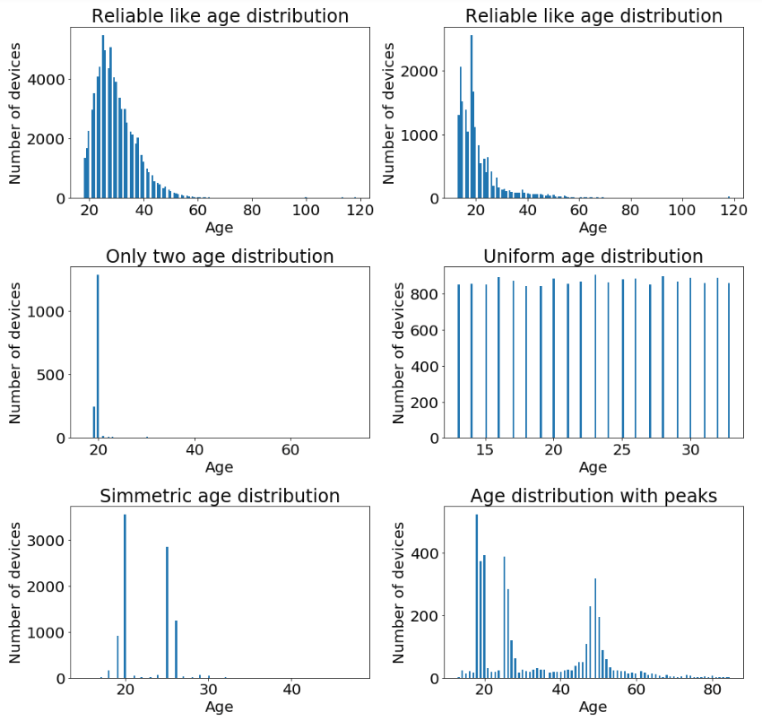
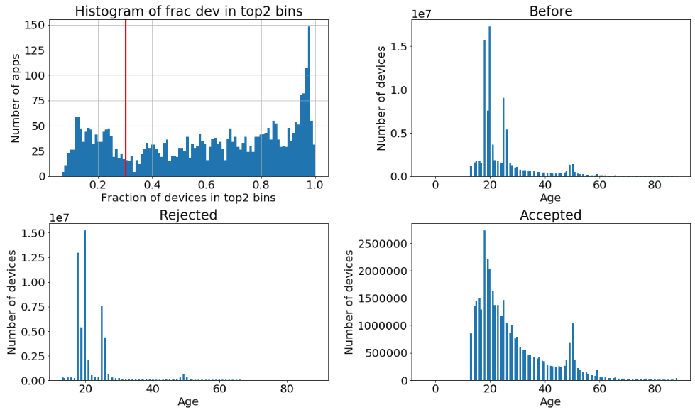

In mobile advertising it is possible to target the audience of the campaign based on some charateristics of the users.
Here we are focusing on the age.
However, these informations are only provided on by a subset of apps during the bidding process.
To increase the available targeting audience we would need an estimation of the age for the devices which never use those apps and here is when the machine learning comes into place.

To train a supervised machine learning for infearing the age over all the devices we need: 
- a **reliable ground truth** datasets (in our case the age for certain devices);
- the **features** which will go as inputs to the model.

The ground truth has to be reliable or the model will learn non realistic structure.
Moreover, it could improve the performances of the training.
In this post it is discussed only the ground truth selection step, leaving the feature creation, the tuning, the train and the prediction of the model for the next time.

Reliability is not a statistic quantity that you can find in the books.
To summarize the concept in one phrase, we could state that your data are reliable as long as all your results follow an explainable behaviour without any inconsistency results.
It is based on this idea that we have studied and discovered some pattern in the data that in the end we prefer to exclude from the ground truth dataset.

We can structure the age information unreliability in two ways:
* consistency of a deviced as observed multiple times on the same app;
* consistency of a device as observed in differnt apps.

A very simple example of the two situations (plus a reliable age information) can be observed in the data sample below.
<p align="center">  </p>

**Inter app reliability**:<br/>
In the plot below you can find some **examples of the age distribution** for four apps.

Different apps show a clear different age distribution.
However, it is clear that some of the distributions in the plot do not seem to make really sense.
Why would people from 17-18 correspond to more than 95% of the total users of the app? (What happens to the 16ties? or 19ties?)
Why would apps have the same numbers of devices for every age in a specific range?
These must be very special apps, or the data do not correspond to truth.
What we want to do is to exclude these apps.
Since we want to make a clear statement about the age distribution of the devices which visit a certain app, we exclude those where the amount of users is not enough to draw any statistical conclusion.
This is not a big issue since the devices contained in these apps are few by definition, so we do not cut off too many data in this way.

Let's describe the main pattern we discover in the data and how we get rid of them.

* **Few ages**<br/>
Certain apps seem to provide almost always only two/three values.
We create a variable (frac12) which is the fraction of devices contained in the two top most frequent ages observed in the app.
Apps where the frac12 value is higher than 30% are excluded.
Below you can see the distribution of the frac12 variable and the consequences of the rejection of the non reliable apps on the total age distribution.

The red vertical line indicates the threshold we apply over the frac12 feature.


* **Uniform distribution**<br/>
One of the four examples (the bottom left one) clearly show a uniform generated distribution.
Detect those apps is relatively easy, since for a fixed device a different age will be provided every time the device accesses the app.
For every devices which have been observed at least twice in the app, we calcualte the max - min age value and, then, we calculate the average of this differences.
In the image you can see the distribution of the avg_range_age variable and the effect of the cut on the global distributions.


* **Symmetric like shapes**<br/>
Certain distributions show a shape which seems to be suspicious symmetric.
Using the [skewness](https://en.wikipedia.org/wiki/Skewness) statistical measure we can select those and drop them out.
In the plot below you can see the distribution of the skewness and the effect of the cut on the global distributions.


* **Too many peaks**<br/>
Using a basic peak detecting algorithm, written in pyspark and reported below, we can count the number of peaks on the age distribution.
```python
from pyspark.sql import functions as F
from pyspark.sql.types import IntegerType
from pyspark.sql import Window
def get_apps_with_peak_information(df):
    window_frac = Window.partitionBy(df['apps']).orderBy(df['age'].asc())
    df = df.withColumn("lag_1", F.lag("num_dev_per_age", 1).over(window_frac))
    df = df.withColumn("lag_2", F.lag("num_dev_per_age", 2).over(window_frac))
    df = df.withColumn("lag_3", F.lag("num_dev_per_age", 3).over(window_frac))
    df = df.withColumn("lead_1", F.lead("num_dev_per_age", 1).over(window_frac))
    df = df.withColumn("lead_2", F.lead("num_dev_per_age", 2).over(window_frac))
    df = df.withColumn("lead_3", F.lead("num_dev_per_age", 3).over(window_frac))
    df = df.withColumn(
        "is_higher_than_nei",
        ((df.num_dev_per_age > df.lag_1) &
         (df.lag_1 > df.lag_2) &
         (df.lag_2 > df.lag_3) &

         (df.num_dev_per_age > df.lead_1) &
         (df.lead_1 > df.lead_2) &
         (df.lead_2 > df.lead_3)
         ).cast(IntegerType())
    )
    df = df.withColumn("frac_for_peak", 
                       (df.frac_num_age > peak_threshold).cast(IntegerType()))
    df = df.withColumn("is_a_peak", df.frac_for_peak * df.is_higher_than_nei)
    return df.groupby("apps").agg(F.sum("is_a_peak").alias("num_peaks"))
```
Cutting at 1.5 on the plot we drop distributions with more than one peak detected and we can observe that the rejected apps do not have a clear age-interest trend.


It surprises us to see that the ammount of apps with an unrealistic distribution is so high.
However, since the model benefits from the chirurgical operation and we sill have plenty of devices to train on, we do not esitate on rejecting those apps.


**Intra apps reliability**<br/>
The next step is to exclude the app which are not consistent with the other apps.
In the table below you can see that it is no garantee that for different apps the same age information is provided.
<p align="center">  </p>
Throught a statitical algorithm that we implemented, the inconsistent apps are rejected.
There are very few apps excluded by this process, thanks to the already very accurate selection operated in the inter app reliability step.
We conclude this post showing the age distribution before and after the entire selection.


**Production**<br/>
All these rules are put into production via a oozie pipeline which calls a spark job that implements all the described selections.
The final output are two tables, one which contains the deviceID and the age of the user and another one with the apps and a flag which states the reliability status (used for monitoring purpose).
Every day, as new data come in, the oozie pipeline preocesses the data combined the last two weeks and updates the two tables. 

Now that we have a consistent ground truth we can build up a supervised machine learning model which can be used to estimate the age on devices where we do not have any reliable age information.
This post is already too long, so we will continue the discussion on the next one, stay tuned.
