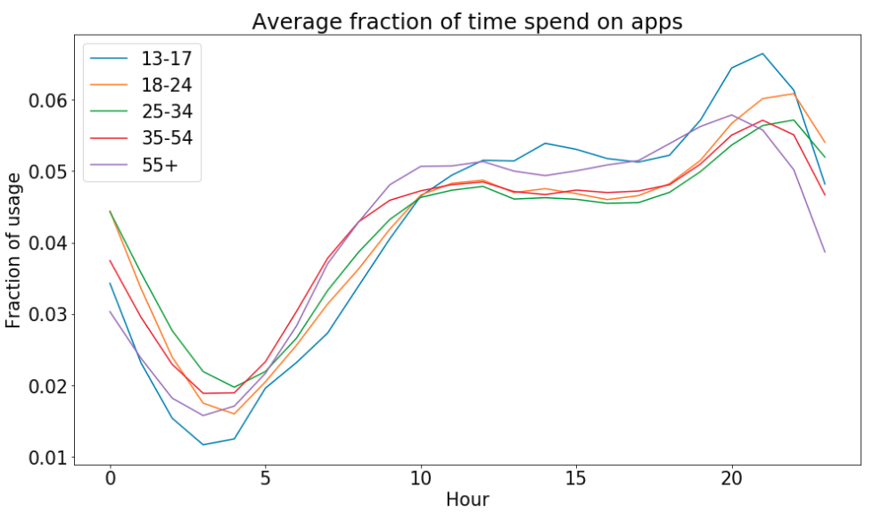
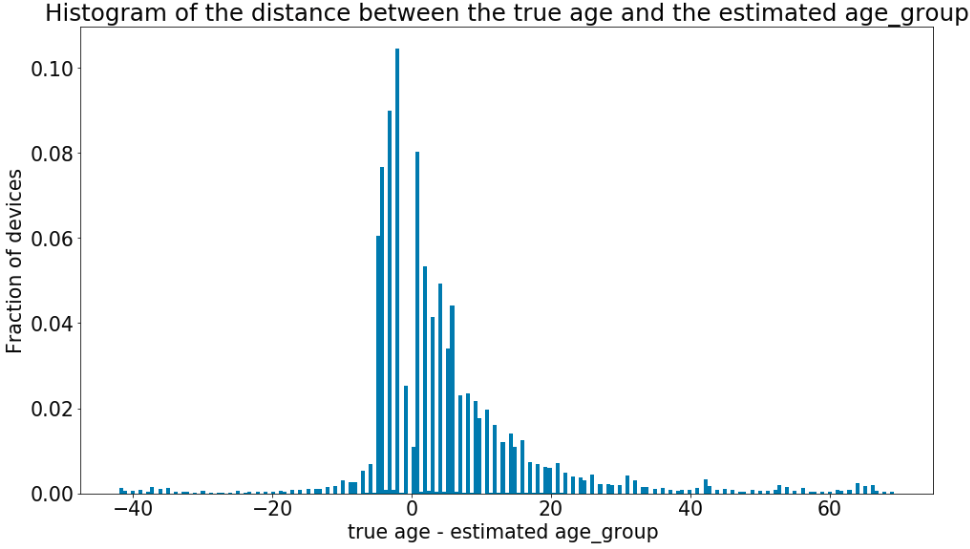

Goal of the project: extend the age targeting audience providing and estimation of the age for all the devices, in particular,  when the ground truth age information is not known. 

**Ground truth selection**<br/>
In the previous [post](https://adello.github.io/Age-Targeting-Part1/) we described how the ground truth reliable dataset was created.
It looks like this:
<p align="center">  </p>
In the table you can see that from the age column the age_group one is computed.
In total we use 5 classes, based on the requests of our customers.
So, we are talking about a multiclass supervised machine learning model.

To make the target usable to the spark ML library we need to map the age_group string into an index.

```python
from pyspark.ml.feature import StringIndexer
label_stringidx = StringIndexer(inputCol=target_col, outputCol=label_col)
df = label_stringidx.fit(df).transform(df)
```

Now let's have a look at the distribution of the ground truth:
<p align="center">  </p>
As expected, some classes are less frequent then others making the dataset unbalanced.
The introduction of a weight for each class helps the model to take the unbalance into account during the training phase.
The weights are calculated throught the following code:

```python
def get_weight_function(label_counts):
    max_cnt = float(max(label_counts.values()))
    label_weight = {k:max_cnt/v for k, v in label_counts.items()}

    def get_value(x):
        return label_weight[x]
    return get_value, label_weight

row_counts = df.groupby(label_col).count().collect()
label_counts = {row[label_col]:row["count"] for row in row_counts}           
get_weight, label_weight = get_weight_function(label_counts)
df = df.withColumn(weight_col, F.udf(get_weight, DoubleType())(label_col))
```


**Feature creation**<br/>
To extract the features from the raw data we use a combination of hive and spark queries.
To train the model in spark allows us to scale the huge amount of devices we have, plus we can also benefit from the already implemented preprocessing pipelines of the ML spark library.

The question to keep in mind while creating the feature is: how does people of different age use their smart devices?
Here there is a list of tried features, only the ones which give a contribution are kept in the final model:

* **Time distribution**<br/>
Hour distribution, namely the fraction of the total time spent on apps splitted by hour.
From the plot we can see the average of the hourly fraction calculated over every devices per each classes.
The trends are as expected, the younger ones tend to spend more time on the apps late in the evening, while the older ones like to be active earlier in the morning.
<p align="center">  </p> 
To capture weakly effects we also calculate the same feature on a per day of the week base.

* **The apps**<br/>
The apps used over the last month.
This feature is is directly related with the task for which a person use its smart device and, as we will see in later in the post, it produces the most important features.
We create a bag of apps while keeping into consideration the frequency of use.
```python
from pyspark.ml.feature import CountVectorizer, Normalizer
apps_count_vectorizer = CountVectorizer(inputCol=feature_col, 
                                          outputCol=count_vectorizer_col, 
                                          minDF=min_df)
apps_normalizer = Normalizer(p=2.0, 
                              inputCol=count_vectorizer_col, 
                              outputCol=normalizer_col)
```
Apps visited by few devices increase the possibility to overfit, we can cut off these ones via the minDF parameter of the CountVectorized class.

* **Make and model**<br/>
Both make and model can be expressed as categorical features and treated via [One Hot Encoding](https://en.wikipedia.org/wiki/One-hot).
Due to the high cardinality of the models we regroup the low frequency within a single index to avoid statistical fluctuations.
We know that certain models can be more appealing for younger people while others could have different functionalities more appreciated in the adult phase (e.g. a big screen of a pad).
```python
from pyspark.ml.feature import OneHotEncoderEstimator
make_model_ohe = OneHotEncoderEstimator(inputCols=[make_col, model_col], 
                                           outputCols=[make_col_out, model_col_out])
```

* **The home country**<br/>
The home country of the deviced is preprocessed as a categorical feature via One Hot Encoding.
It is a proxy for many different quantities such as economy wealthy, age distribution, education system, etc...

* **Number of apps**<br/>
Number of distinct apps used by the device.
People which tends to adapts to new technologies faster (often the youger) could use a larger numbers of apps for their daily needs.
StandardScale is applied to rescale the data into a range closer to the unity, so that these values can be well accepted even by Neural Networks models.
```python
from pyspark.ml.feature import StandardScaler
num_apps_standard_scaler = StandardScaler(inputCol=number_of_apps_col, 
                                            outputCol=number_of_apps_output_col, 
                                            withMean=True, 
                                            withStd=True)
```

All these features are then aggregated into a single vector column to satisfy the spark structure.
The overall preprocess can be explicited as a single pipeline.

```python
from pyspark.ml.feature import VectorAssembler
va = VectorAssembler(inputCols=list_with_all_the_features_column_name, 
                     outputCol=outputcolname)

from pyspark.ml import Pipeline
preprocessing_pipeline = Pipeline(stages=[apps_count_vectorizer, 
                                          apps_normalizer, 
                                          make_model_ohe, 
                                          country_ohe, 
                                          num_apps_standard_scaler, 
                                          va])
```


**Train and trust the model**<br/>
We want to show that the model and so the data source is trustable.
For this reason we use here the results of the Logistic Regression since it is easy to discover what the model learned out from the features.

```python
logistic_regression = LogisticRegression(
    maxIter=max_iter,
    featuresCol=outputcolname,
    labelCol=target_col,
    elasticNetParam=elastic_net_param,
    regParam=reg_param
)
pipeline_train = Pipeline(stages=[preprocessing_pipeline, logistic_regression])
```

The choice of the hyperparameters and of the parameters of the preprocessing pipeline is preformed via cross validation.

```python
params = {
    "min_dfs_site_bundle": features_parameters["apps"],
    "reg_params": reg_params,
    "elastic_net_params": elastic_net_params,
    "max_iters": max_iters
}
all_stages = pipeline_model.getStages()
cv_sb = all_stages[index_for_the_apps]
lr_model = all_stages[-1]
grid_builder = ParamGridBuilder()
grid_builder = grid_builder.addGrid(cv_sb.minDF, params["min_dfs_site_bundle"])
grid_builder = grid_builder.addGrid(lr_model.elasticNetParam, params["elastic_net_params"])
grid_builder = grid_builder.addGrid(lr_model.regParam, params["reg_params"])
grid_builder = grid_builder.addGrid(lr_model.maxIter, params["max_iter"])

evaluator = MulticlassClassificationEvaluator(labelCol=LABEL_COL, metricName="f1")
cv = CrossValidator(
    estimator=estimator,
    estimatorParamMaps=grid_builder.build(),
    evaluator=evaluator,
    numFolds=5
)
cv_model = cv.fit(df)

# Example to get the best parameters values:
logging.info(
    "regularisation parameter from best model: %f",
    cv_model.bestModel.stages[-1]._java_obj.getRegParam() # work-around for Spark bug
)
best_model = cv_model.bestModel
```

It is worth mentioning that the use of the regularization parameters turned out to be the most crucial one for the performances and stability of the model.

The weights of the logistic regression model can be interpreted as a feature importance, thus we can observe the most relevant aspects of our data which allow the model to discover the age behind a certain device.
<p align="center">  </p>
As you can see the best features of each class are the apps used.
Furthermore, it is very satisfing to get a confirmation of what you would expect from your real life experiences.
This gives additional confidence on putting the model into production.

Analyzing the output where the model fails could be also useful.
In the plot you can see the distribution of the difference between the real age and the estimated age_group.
The usual age window we have in our classes is about 10 years so we can say that values around -10, 10 in the histogram correspond to age_group missclassification close to the truth one (e.g. state that a device belong to the class '25_34' while the actual category is '35_54' and the real age is 36).
From the plot we can see that big mistakes, such as missidentify a younger with the older and vice versa, occurs rarely wrt to the one which are closer to the real age_group. 
<p align="center">  </p>
When we analyze those devices we see that they usually use apps which would be commonly associated to the other classes.
In the end you know, it is not important the age you have but the one you feel.


**Predict the AgeGroup of all devices**<br/>
The outputs of the model are the five probabilities for a device to belong to one of the age_group categories.
Comparing the output distribution for every probabilities between the ground truth and the rest of the devices, we can see that there are some differences.
In the picture you have an example. THE PICTURE NEED TO BE CHANGED, EVEN A REWIGHTIED HISTOGRAM COULD HELP THE COMPREENSION HERE.
<p align="center">  </p>
<p align="center">  </p>
These differences are not synonimous of overfitting (that can be excluded because in the test set the distributions are very similar).
In fact, the ground truth is a special part of the entire dataset because it contains the devices which visit the apps that provide the age information.
With other words, the ground truth has a bias wrt to the final dataset where the model will be applied.
If we would estimate any figure of merit from the ground truth as it is we would end up with a bias, non realistic measure.
To fix the bias we reweight the ground truth distribution using the overall shape.
We can say that, for a fixed bin in the distribution, we take the number of devices from the overall one, while the purity for the bin is estimated from the trained dataset.
The reweight is performed separatelly for each country because the output is country-dependent.

After the reweight and independently for every groups we calculate the thresold the corresponding probability should have so that a device will belong to that class with a required precision. 
Different precisions cause different thresholds and recall.
This follows the bussiness idea that customers are more interested on specific age_groups than others and so the precision on every classes should be adjusted independently (In the end there is always a partial dependency since the total sum of the probabilites is always one).


**Put everything into production**<br/>
We put the train-predict structure into production in our cluster creating a oozie pipeline which triggers a spark job on a daily base.
This means that as we collect new data (new devices and apps) we add the part which contains reliable ground truth to the training data, we update the features with the most recent information and we predict over the entire dataset.
The predicted ages are written into Cassandra, in this way the Adello bidding system can access those informations at the bidding time.
A report of the performances is created every time a new model is built to monitoring the status in case of unespected behaviour.
So far we have not observed any undesidered news.

A similar procedure, with all the adaptation to the case, is constructed for the gender case.
But that's for another post.
