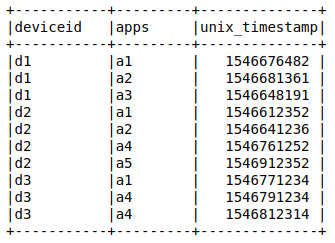
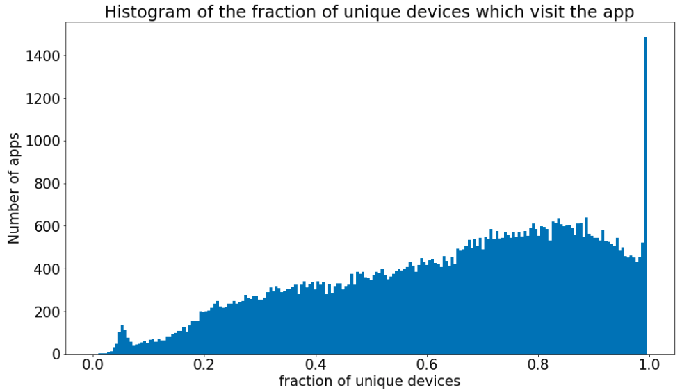
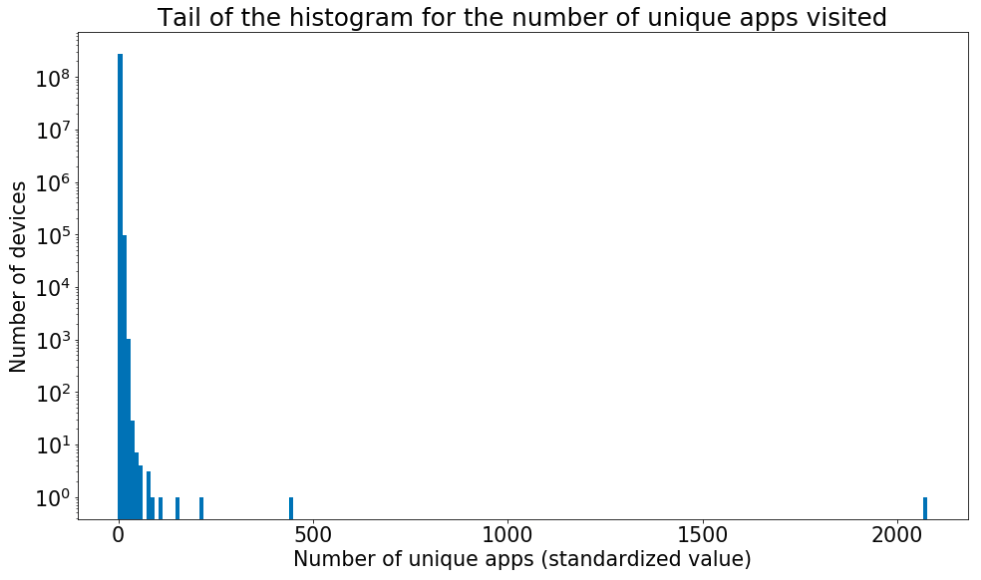
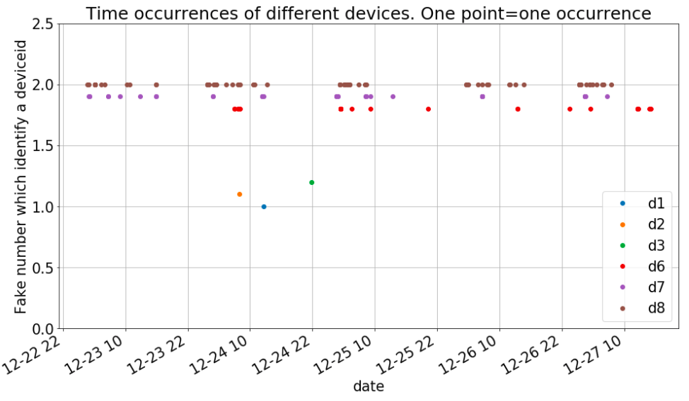
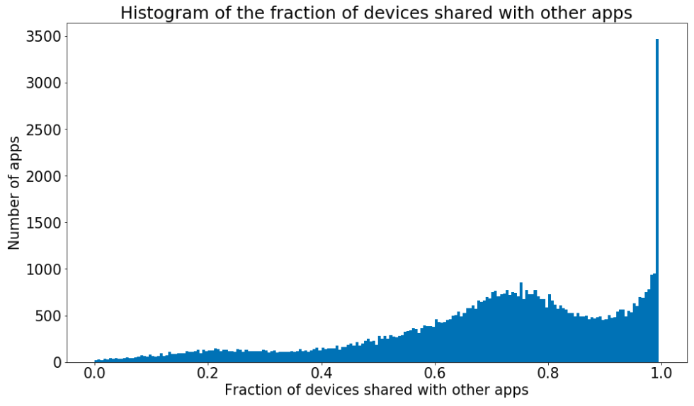

At Adello we are processing a lot of data. 
In a perfect world, we could just take them and use them directly for the benefit of our customers. 
In reality, the data is not always correct and to produce reliable output it is necessary to filter out this inconsistency.
In this post we describe an example of the quality selection we perform at Adello, underlining the benefits we gain from it.

In a [previous post](https://adello.github.io/Tracking/) we introduced the way we identify a device for advertising targeting purpose.
In summary, we use the Android **[Advertising ID](https://support.google.com/googleplay/android-developer/answer/6048248?hl=en)** and the iOS Identifier for Advertisers. 
In the rest of the post we call these random pseudonyms as **deviceID** since we use them as an identifier of a smart device (mobile, pad, etc...).

In particular, it is expected that:
- behind a deviceID there should be a real physical device used by a human person, 
- when a physical device uses different apps, those should give the same deviceID (unless it is resetted by the device's user which definetively does not occur at a per minute/hour frequency).

The base data for all future investigations can simply be described as a list of visits of deviceID and apps at certain times.

  

Quering the dataset via hive or spark we can test if the data looks like what we expect.
The goal of the study is to identify a set of pattern which allows us to select only reliable device identifiers and filter out those which are not real, either because of technical problems or due to fraudulent behavior.
Let's go into details about the discovered patterns.

* **Fraction of unique devices** 
Only apps with a certain number of distinct deviceIDs must be considered to avoid statistical fluctuations.
For each app the ratio of the recorded sessions and distinct device identifiers is calculated.
The value one means that each session has a different device identifier while values close to zero means that all sessions have the same deviceID.
In both situations we consider unreliable the deviceIDs send these apps.

* **Non realistic number of apps** 
For a fixed amount of time (e.g. 1 day) it is possible to observe the number of apps visited by each deviceID.
We see, that there are device identifiers, which can be seen on a huge number of different apps during one day.
These outliers cannot correspond to real human users.

In the plot the number of the vistited apps is standardized (the absolute value minus the overall mean divided by the standard deviation), so that the presence of outliers is evident.

* **Short period of time**: 
When we observe a deviceID for a very short period of time (say 1 minute) but we do not register any other occurrence of the deviceID over several days both in the past and in the future, we do not consider these deviceIDs to be worth of further analysis.
In fact, it is not sure that we have a real person behind it.
For example a machine which automatically reset the value would produce the same data.

The plot above represents the observation of a deviceID in a 5 days period, both for users which shown a regular activity (d6, d7, d8) and for those which appear only once (d1, d2, d3).
Every different device has a different y value to avoid overlaps between the points such that the visualization of the activity for each device is facilitated.

* **Randomly generated deviceID**: 
Some app could provide a randomly generated deviceID.
If this is the case, it is expected that the same deviceID is not observed in any other apps.
We can think about two ways to generate the values:
1) a new random deviceID is created for every acces;
2) a particular transformation of the deviceID is used, thus the provided deviceID for the same real device is always the same but it will not be allined with the one provided by other apps.
In both cases the fraction of devices shared with other apps should be zero.
If we plot the histogram of this fraction we can see that there are no apps around zero.
We can conclude that there are no apps in the data which generate a random deviceID and there is no need to include this selection in the global one.

Of course the same unreliable deviceID can be flagged by more than one pattern.
However, there is not a single method among those which can be completely substituted by the others.
Indeed, we include all of them in our deviceID reliability filter (except the randomly generated one since there are no devices which are randomly generated).

**Put everything into production:** 
We put this quality filter selection into production creating an oozie pipeline which calls the hive queries that implement the described methods.
The pipeline runs on a daily base, acquiring new data and filtering out the unreliable device identifiers.
To monitor the amount of the rejected devices and apps we store all the calculated information such that it is easy to trace back for which reason the data have been flagged as unreliable.  

**Main benefits:** 
* Higher quality and reliability of your data mean higher correctness of business insights and better performances.
In the end our customers wants to target specific audience and the procedure to select that audience can only benefit from the removal of the broken data.
You could think the data quality selection like the restoration of a piece of art.
It is only when you remove the pollution effects that you can enjoy the original colors used by the artist.
* The data quantity is reduced, so the computation time is speed up.
Indeed, the quality filter is applied as soon as possible to optimize the overall general data flow. 
* The quality selection is agnostic with respect to the model we apply. 
Every process which uses those data will benefit from the quality selection applied.
When you keep the fake devices which visit 1000 apps per day you should not be surprised if consuming processes won't get the best out of that information.

To conclude we could paraphrase what the ancient Romans use to say: business sano in data sano.
