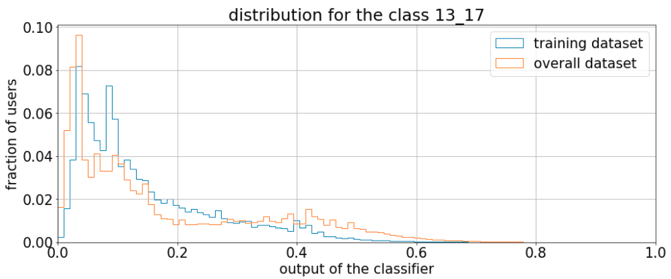

In mobile advertising it is possible to target specific audiences based on some characteristics of the users, such as the age. 
However, this information is not available for every users.
We build a supervised machine learning model to extend the knowledge over the whole dataset.
In the previous [post](https://adello.github.io/Age-Targeting-Part1/) we described how the reliable ground truth dataset was created.
It looks like this:
<p align="center">  </p>
For these devices we know the age and we convert it into five ranges: 13_17, 18_24, 25_34, 35_54, 55+.
These are the classes used as target in the training of the machine learning model.

To deal with the huge amount of mobile traffic we make use of Spark, plus several Hive queries to create the raw data. 
The Spark ML library requires the target column to be an integer in the range [0, number of classes) and provides the StringIndexer class to transform your column. 

```python
from pyspark.ml.feature import StringIndexer

label_stringidx = StringIndexer(inputCol=target_col, outputCol=label_col)
df = label_stringidx.fit(df).transform(df)
```

**Deal with the unbalance of the classes**<br/>
Now let's have a look at the distribution of the ground truth:
<p align="center">  </p>
As expected, some classes are less frequent than others.
An unbalanced dataset can lead to problems in the training.
The model cannot learn the optimal patterns to distinguish the lower occurence class from the more frequent ones.
The introduction of a weight for each class helps the model to avoid this problem since classes with few data will be considered more important to be correctly predicted.
The weights are calculated with the following code.
It produces a weight column in the dataframe.

```python
def get_weight_function(label_counts):
    max_cnt = float(max(label_counts.values()))
    label_weight = {k:max_cnt/v for k, v in label_counts.items()}

    def get_value(x):
        return label_weight[x]
    return get_value, label_weight

row_counts = df.groupby(label_col).count().collect()
label_counts = {row[label_col]:row["count"] for row in row_counts}           
get_weight, label_weight = get_weight_function(label_counts)
df = df.withColumn(weight_col, F.udf(get_weight, DoubleType())(label_col))
```


**Feature creation**<br/>
The question to keep in mind is: how do people of different age use their smart devices?
The more difference can be seen between different classes in a feature, the better it is.
Only the ones which contribute to improve the prediction are kept in the final model.

* **Time distribution**<br/>
We calculate the hourly and weekly usage distribution, namely the fraction of the total time spent on apps split by hour or by day of the week.
In the plot we can see the average of the hourly fraction calculated for each classes.
The trends follow the expectations: the younger tend to spend more time on the apps late in the evening, while the older like to be active earlier in the morning.
<p align="center">  </p>

* **The apps**<br/>
We collect the used apps over the last month for each device.
This feature is directly related to the different kind of usages for a smart devices.
As we will see later in the post, it has the strongest relation to the age.
To be passed as a feature in the machine learning model, we transform the list of used apps to a [bag of words](https://en.wikipedia.org/wiki/Bag-of-words_model) via the CountVectorizer class in Spark.
In this way every app constitutes a single feature.

```python
from pyspark.ml.feature import CountVectorizer, Normalizer

apps_count_vectorizer = CountVectorizer(inputCol=feature_col, 
                                        outputCol=count_vectorizer_col, 
                                        minDF=min_df)
apps_normalizer = Normalizer(p=2.0, 
                             inputCol=count_vectorizer_col, 
                             outputCol=normalizer_col)
```
The minDF parameter of the CountVectorizer class is used to cut off apps visited by few devices to decrease the noise in the dataset and the chance to overfit.

* **Make and model**<br/>
We know that certain models can be more appealing to younger people while others could have different functionality more appreciated in the adult phase (e.g. a large screen).
Both make and model can be expressed as categorical features and treated via [One Hot Encoding](https://en.wikipedia.org/wiki/One-hot).
Due to the high cardinality of the models we map the low frequent occurrences into a single index to reduce the sparsity of the data and reduce overfitting.

```python
from pyspark.ml.feature import OneHotEncoderEstimator

make_model_ohe = OneHotEncoderEstimator(inputCols=[make_col, model_col], 
                                        outputCols=[make_col_out, model_col_out])
```

* **The home country**<br/>
The home country of the device is preprocessed as a categorical feature via One Hot Encoding analogous to the make and model.
It is a proxy for many different quantities such as economy wealthy, age distribution, etc...

* **Number of distinct apps**<br/>
Young people tend to adapt new technologies faster and therefore could use a larger number of apps.
StandardScale is applied to rescale the data into a range closer to the unity, so that these values can be well accepted even by Neural Networks models.

```python
from pyspark.ml.feature import StandardScaler

num_apps_standard_scaler = StandardScaler(inputCol=number_of_apps_col, 
                                          outputCol=number_of_apps_output_col, 
                                          withMean=True, 
                                          withStd=True)
```

**Putting all together**<br/>
Spark requires all features to be aggregated into a single vector column.
Moreover, the overall process can be expressed as a single pipeline.

```python
from pyspark.ml.feature import VectorAssembler
from pyspark.ml import Pipeline

va = VectorAssembler(inputCols=list_with_all_the_features_column_name, 
                     outputCol=outputcolname)
preprocessing_pipeline = Pipeline(stages=[apps_count_vectorizer, 
                                          apps_normalizer, 
                                          make_model_ohe, 
                                          country_ohe, 
                                          num_apps_standard_scaler, 
                                          va])
```


**Train the model**<br/>
As machine learning method, we start with the Logistic Regression.

```python
logistic_regression = LogisticRegression(
    maxIter=max_iter,
    featuresCol=outputcolname,
    labelCol=target_col,
    elasticNetParam=elastic_net_param,
    regParam=reg_param
)
pipeline_train = Pipeline(stages=[preprocessing_pipeline, logistic_regression])
```

The choice of the hyperparameters of the logistic regression and the preprocessing pipeline is preformed via cross validation.
We use five folds and use the f1 metric to select the best result.

```python
params = {
    "min_dfs_site_bundle": features_parameters["apps"],
    "reg_params": reg_params,
    "elastic_net_params": elastic_net_params,
    "max_iters": max_iters
}
all_stages = pipeline_model.getStages()
cv_sb = all_stages[index_for_the_apps]
lr_model = all_stages[-1]
grid_builder = ParamGridBuilder()
grid_builder = grid_builder.addGrid(cv_sb.minDF, params["min_dfs_site_bundle"])
grid_builder = grid_builder.addGrid(lr_model.elasticNetParam, params["elastic_net_params"])
grid_builder = grid_builder.addGrid(lr_model.regParam, params["reg_params"])
grid_builder = grid_builder.addGrid(lr_model.maxIter, params["max_iter"])

evaluator = MulticlassClassificationEvaluator(labelCol=LABEL_COL, metricName="f1")
cv = CrossValidator(
    estimator=estimator,
    estimatorParamMaps=grid_builder.build(),
    evaluator=evaluator,
    numFolds=5
)
cv_model = cv.fit(df)

# Example to get the best parameters values:
logging.info(
    "regularisation parameter from best model: %f",
    cv_model.bestModel.stages[-1]._java_obj.getRegParam() # work-around for Spark bug
)
best_model = cv_model.bestModel
```

It is worth mentioning that the introduction and the tuning of the regularization parameters turned out to be crucial both for the performance and the stability of the model.

**Trust the model**<br/>
We want to know, if the model and the ground truth are reliable.
Therefore, we have a look into the weights of the trained Logistic Regression Model.
These weights can be interpreted as importance  of the features.
The top ones are shown in the picture below.
Thus, we can observe the most relevant aspects of our data which allow the model to discover the age behind a certain device.

|age_group|weight|app description                                |
|---------|------|---------------------------------------------|
|13-17    |3.22  |discover the meaning of my name                |
|13-17    |2.34  |math operation to solve homework exercise      |
|13-17    |2.29  |famous birthdays                               |
|18-24    |2.65  |game with quiz                                 |
|18-24    |2.54  |test your competence                           |
|18-24    |2.19  |test simulation                                |
|25-34    |2.53  |chat, meet and date                            |
|25-34    |2.24  |financial balance check                        |
|25-34    |1.91  |calculator                                     |
|35-54    |2.25  |videogames                                     |
|35-54    |2.24  |photo collage                                  |
|35-54    |1.73  |sport tracking (bike, jogging)                 |
|55+      |2.14  |news and wether forecast                       |
|55+      |2.08  |solitarie card games                           |
|55+      |2.04  |solitarie card games                          |

As you can see the best features of each class are the apps used.
Due to the bag of words preprocess on this feature, every apps is a distinct input, so the weights in the table are directly related to the discrimination power derived by the usage of that app.
Moreover, the list makes extreme sense based on naive expectation.
Solving your math homework is mostly a task you want to support with an app when you are young.
In certain periods of your life you will probably do big expense (e.g. an house or a boat) and you are more likely to check your financial balance with more attention.
Games and sport will still be with you during your mature age and at some point you will have enough patience to appreciate the old classic card games. 
This gives additional confidence in the behavior of the model.

Analyzing the output of the model is very helpful, especially in the cases it is wrong.
In the plot you can see the distribution of the difference between the real age and the estimated age_group.
Keep in mind that every class spans about ten years.
Therefore, the range from -10 to 10 corresponds to adjacent misclassified classes.
For example, if the age of the device is 36 and the model predicts the class 25_34 we have a distance of 36 -34 = 2 ∈ [-10, 10].
Big mistakes, spanning more than one class occur rarely in comparison to the adjacent-like mistakes. 
<p align="center">  </p>
When we analyze those devices we see that their app usage would be commonly associated to the other classes.
Well, in the end it is not important how old you are, but how old you feel.


**Prediction over the entire dataset**<br/>
The model gives as output the five probabilities for a device to belong to each of the age group categories.
We use those probabilities in the ground truth sample to check the quality of the training and in the rest of the data to estimate the age of the users.
In the plot below you can see the distribution for these two datasets for one of the five probabilities.
We can see that the shape of the two distribution are different.
<p align="center">  </p>
These differences are not necessarily an indication for overfitting (that can be excluded because in the test set the distributions are very similar).
In fact, the ground truth is a special part of the entire dataset because it contains the devices which visit the apps that provide the age information.
With other words, the ground truth has a bias with respect to to the final dataset which the model is applied on.
To fix the bias, we reweight the ground truth distribution using the shape from the other dataset.
Since the output distribution is country-dependent, the reweighting is performant separately for each country.

After the reweighting is done independently for each group, we calculate a threshold.
The threshold corresponds to a certain precision and is determined for each class and country.
Therefore, we can predict the age group of all devices for each country and classes with the same confidence.
Different precisions relate to different thresholds and recall.

**Put everything into production**<br/>
We put the train-predict structure into production creating an Oozie pipeline which triggers a Spark job on a daily basis.
Thus, as we collect new data (new devices and apps) the features are recalculated with the most recent information and a new training is performed.
A report of the performances is created to monitoring the status and detect cases of unexpected behaviour. 

A similar procedure, with all the adaptation to the case, is constructed for the gender case.
But that's for another post.
