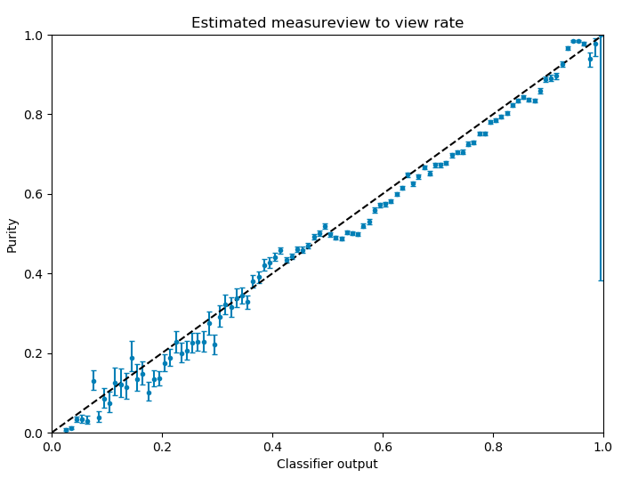

Hello. Let me start by telling you, that viewability is somewhat of a pet peeve of mine. First of all, the word is dumb. It is in artificial creation of the advertisement industry, which due to some strange reason does not want to use the perfectly fine "visibility".
And viewability measurement and delivery should be the absolute standard nowadays. According to the [definition of the IAB](https://www.iab.com/wp-content/uploads/2015/06/MRC-Viewable-Ad-Impression-Measurement-Guideline.pdf), an advertisement is considered viewable (*crinch*) when more than 50% of its content were in the viewport for more than one second.
From my point of view, this should be the absolute minimum for an ad to be "delivered".
But interestingly, the guarantee of viewability is not in high demand. We offer the possibility of only paying for viewable impressions, admittedly, for a markup. But simple math leads you to the inadvertend conclusion, that it is well worth investing the markup if you are interested in viewable impressions. Given, that the average viewability rate in the market is 50%, this should be a no-brainer.

So, now that I got this out of my system, I want to explain, how we measure and deliver viewability.

### Measuring

The viewability itself is measured in the adunit itself. Thus, JavaScript code is executed as part of the AdUnit. This code detects, if we can measure the viewability and if yes, it was viewable. Since we rely on the available APIs, the way of measurement depends strongly on the environment, e.g. mobile web vs. app and which version of APIs and browsers are available.

#### App
In apps, we first check if a version of [MRAID](https://www.iab.com/guidelines/mobile-rich-media-ad-interface-definitions-mraid/) is available. MRAID is a bridge of the native component of an app into the JavaScript container the adunit is running in. If MRAID is available, we can simply call

```javascript
mraid.isViewable()
```

to know, whether the is currently visible or not. But since we need not only to know, if the adunit is viewable, but also how long, we need to monitor the status. Instead of recalling the upper function every couple of milliseconds, we make use viewable change event, specified in MRAID:

```javascript
var mraidEvent = mraid.EventType ? (mraid.EventType.VIEWABLE_CHANGE || 'viewableChange') : 'viewableChange';
mraid.addEventListener(mraidEvent, onMraidViewableChange);

function onMraidViewableChange() {
   mraidViewable = mraid.isViewable();
}
```


#### Mobile web

The mobile web comes with a bigger variety of environments. Safari and Chrome are the two main browsers and they come with different capabilites. In addition, the available information depends on the fact, if the adunit runs in a friendly or unfriendly iframe. An iframe is unfriendly if it is running with a different source than the original website.

##### 1. Intersection Observer
The simplest and most reliable case are browsers which support the [IntersectionObserver API](https://developer.mozilla.org/en-US/docs/Web/API/Intersection_Observer_API). In this case we can just call it with

```javascript
    var _ioSettings = {
       threshold: 0.5
    };
    var _ioCallback = function(entry) {
       isElementVisible = entry[0].intersectionRatio >= 0.5;
    };
    var elementObserver = new IntersectionObserver(_ioCallback, _ioSettings);
    elementObserver.observe(element);
```


##### 2. Safari painting behavior
When this API is not available, e.g. in older browsers, we try different methods. If the ad is running in a modern Safari browser and in an unfriendly iframe, we can make use of an optimization mechanism of Safari. It prevents the rendering of content in unfriendly iframes if they are not in the viewport. Therefore, we are putting a beacon in the middle of the iframe and check if is rendering. If it is, we know that the ad is viewable.

##### 3. Scrolling
If none of the above methods is applicable, we make use of the browser api to monitor and the scrolling of the webpage and calculate the position of the viewport ourselves. This is only possible if the adunit positioned in the topframe of the site or in a friendly iframe. We try to avoid this method, since it is relatively computing intensive in comparison to the other methods.

If none of the methods is usable, we are not able to measure the viewability. In total, we are able to measure the viewability in about 80% of all delivered impressions.


### Delivering

So now we have for each impression the information if a) we could measure the viewability and b) if it was viewable.
In general, we count unmeasurable impressions as not viewable. This is cool so far. It is very similar to a service you can buy from the IAS for instance.
In addition, we use this information to deliver campaigns with viewable impressions as primary KPI. Thus, we want to be able to buy viewable impressions for a given price.
The naive approach would be to take the average viewability rate of all websites and apps and decrease the bidding price by that. It is possible, that this is working, but since you would decrease the buying price by an considerable fraction, the available inventory might just be too low or too bad in quality.
Alternatively, you could select websites and apps with a high viewability rate and only deliver on them. This approach might be feasable, but it involves a very high degree of manual optimization and you'd still need to decrease the bidding price. Plus, it only makes use of one information (the publisher) while a lot of other information might be related to the viewability rate.
Therefore, we use machine learning as approach. The general idea is to weight each individual bid by the probability of viewability.

#### Training

We train two independent machine learning models, one for the measurability and one for the viewability. The measurement is a mainly technical problem and therefore is influenced by the browser version, the publisher, or the operating system.
The viewability is influenced mostly by the publisher, the adunit itself, and the position on the site. Since the relation between those features are very different for the different metrics, we separate them in independent models.
Based on historic data, we have a ground truth dataset in the form:
> impression ID | measurable | viewable | features
> 1234 | 1 | 0 | *list of features*
> 1235 | 1 | 1 | *list of features*

The features consist of various properties of the context (e.g. app/site, position on the site), the content (e.g. size of the adunit, and the user and device (e.g. operating system, browser version)
For the measurement model we take all impressions and use the measurable column as target in a supervised classification model (namely a Neural Network).
The output of this model is the probability of each impression to be measurable. The viewability model takes all impressions, which are measurable and uses the viewability column as target.
This model gives a conditional probability of viewability for impressions which are measurable. Thus, the total probability of viewability is:

TODO: Insert nice looking formula here

We perform a training of this model every couple of hours to be sure to make use of all recent campaign and publisher data.

#### Application

We can use the combination of the two models in our real-time bidding platform to get the probability for each impression we want to bid on. Then, we can scale the bidding price with this probability.
So, if a viewable impression has the value of one cent to us and the probability of a view is 50%, we are bidding half a cent. If we buy two impressions with that probability for that price, we will get one viewable impression on average and pay one cent.
Mission accomplished. There are two interesting aspects to this: First, we do not buy the viewable impressions for the cheapest possible price. This is approached with another mechanism. We are buying the viewable impression for a defined price and can allways be sure, to buy for that price or lower.
This allows us to sell the viewable impression for a specific price. If we configure a price, which is too low we might not be able to buy the desired amount of impressions, but we will not over-pay.
And second, this mechanism does not necessarily improve the rate of viewable impressions. We do not care if we buy many impressions with a low viewability rate or a few with a high. Since the potential customer only cares about viewable impressions, this is OK.

#### Monitoring

But this whole idea only works, if we have two classification models which give us an unbiased probability. Thus, if the output of the model is 0.5, half of the impressions should lead to a view. A lof of data-science libraries support this kind of output but many aspects of the data and the model can break this concept.
Therefore, we monitor this capability by regularly producing and checking the following plot:
<p align="center">  </p>

On the x-axis you can see the output of the machine-learning model. On the y-axis is the ratio of events (fraction of measures/views) in a bin of the output. If the output of the model is a probability, the data points should all lie on the diagonal y = x within their uncertainty.
The uncertainty originates from the inherent error on the fraction due to the probabalistic nature of the numbers.

Based on plots like this, we judge and monitor the performance of our delivery. As you can see, the relation is not perfect, but it is well within the requirements of the approach.

I hope, this gave some interesting insights into our system. There are many more aspects to this system: The specifics of the model itself, the pitfalls in the measurement, the integration into the real-time system,... But the article is already long enough. If you are interested in something specific, we would be thrilled to hear from you :)