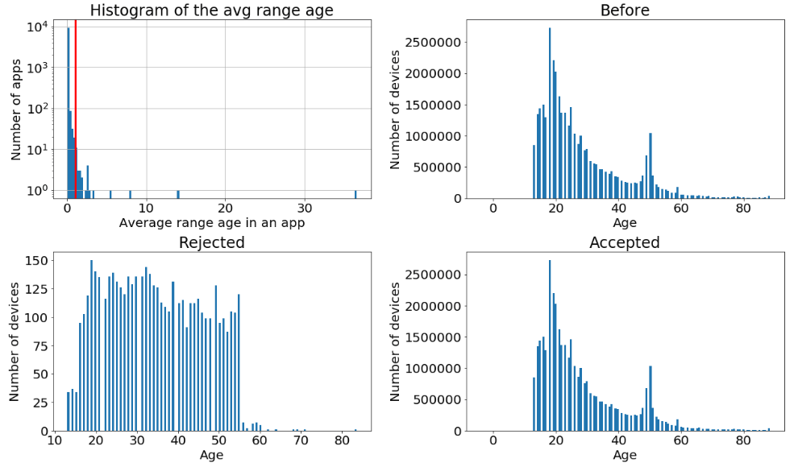
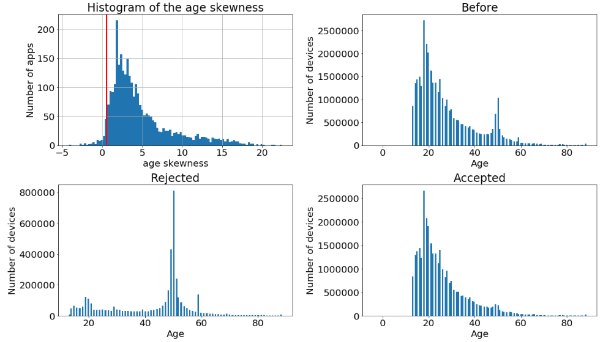
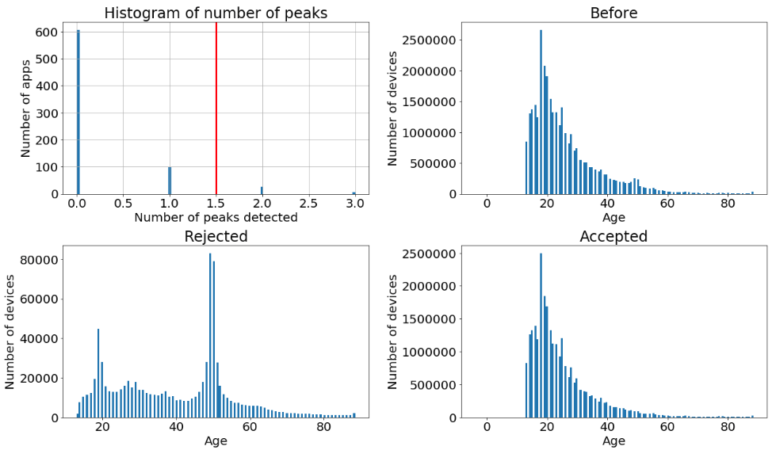
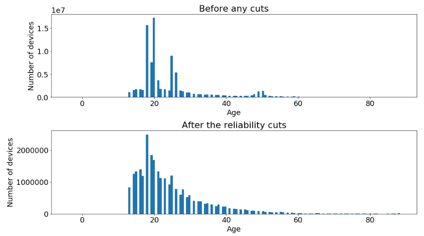

In mobile advertising it is possible to target specific audiences based on some characteristics of the users.
Here we are focusing on the age.
Some apps provide the year of birth of their users.
We actually do not know, where those apps derive the age from.
But often, they require a registration step where you would provide your year of birth.
However, these informations are only given on by a subset of apps during the bidding process.
To increase the available targeting audience we use the information we get on the small subset of devices to infer the age of other, unknown users.
To achieve this, machine learning comes into place.

To train a supervised machine learning for infearing the age over all the devices we need: 
- a **reliable ground truth** datasets (in our case the age for certain devices);
- the **features** which will go as inputs to the model.

In this post, we only discuss the ground truth selection step, leaving the feature creation, the tuning, the train and the prediction of the model for the next time.

**Introduction: the importance to seek the truth**<br/>
The ground truth has to be reliable or:
- the model will learn non realistic structures;
- the performances of the model will decrease since the unreliable ground truth is based on arbitrary or random relations.

Reliability is not a statistic quantity that you can find in the books.
To summarize the concept in one phrase, we could state that your data are reliable as long as all your results follow an explainable behaviour without any inconsistenties.
This is based on the fact, that we often find patterns which imply some problems in the data.
We want to discover all of those patterns and exclude them from our dataset.

We can structure the age information unreliability in two ways:
1. consistency of a deviced as observed multiple times on the same app;
2. consistency of a device as observed in different apps.

**1) Inter app reliability**:<br/>
In the plot below you can find some **examples of the age distribution** for six apps.

Different apps clearly show different age distributions.
However, it is clear that some of the distributions in the plot do not make sense.
Why would people from 17-18 correspond to more than 95% of the total users of the app? (What happens to the 16ties? or 19ties?)
Why would apps have the same numbers of devices for every age in a specific range?
These must be very special apps, or the data do not correspond to truth.
What we want to do is to exclude these apps.
A rejection/accept statement is drown only when we have enough users observed in the app.
In case the number of users is too low we do not consider them in the study and in the final ground truth selection.  
This is not a big issue since the devices contained in these apps are few by definition, so we do not cut off too many data in this way.

Let's describe the main pattern we discover in the data and how we get rid of them creating ad hoc variable via pyspark functions (spark allows to scale and run over the entire dataset).


* **Few ages**<br/>
Certain apps provide almost always only two/three values.
We create a variable (frac12) which is the fraction of devices contained in the two top most frequent ages observed in the app.
Apps where the frac12 value is higher than 30% are excluded.
Below you can see the distribution of the frac12 variable and the consequences of the rejection of the non reliable apps on the total age distribution.

The red vertical line indicates the threshold we apply over the frac12 feature.
Here the code we use to calculate the frac12 over all apps:

```python
from pyspark.sql import Window
from pyspark.sql import functions as F

def get_site_with_frac_top_two_bin_information(df_app_dev_age):
    """Return the apps with the frac12 column which indicate the ammount of deviceid 
    observed in the two top age."""
    df_app_age = df_app_dev_age.groupby(["apps", "age"]).agg(
        F.count("deviceid").alias("num_dev_per_age"))
    
    window_num_dev = Window.partitionBy(df_app_age['apps'])
    df_app_age = df_app_age.withColumn(
        "num_dev", F.sum("num_dev_per_age").over(window_num_dev))
    df_app_age = df_app_age.withColumn(
        "frac_num_age", df_app_age.num_dev_per_age / df_app_age.num_dev)
    
    window_frac = Window.partitionBy(df_app_age['apps']).orderBy(
        df_app_age['frac_num_age'].desc(), "rand")
    df_app_age = df_app_age.withColumn("rank_frac", F.rank().over(window_frac))
    df_app_frac12 = df_app_age.filter(df_app_age.rank_frac < 3).groupby("apps").agg(
        F.sum("frac_num_age").alias("frac12"))
    return df_app_frac12
```

* **Uniform distribution**<br/>
We found out apps where for a fixed device a different age is provided every time the device accesses the app.
For every devices which have been observed at least twice in the app, we calculate the max - min age value and, then, we calculate the average of this differences.
In the image you can see the distribution of the avg_range_age variable and the effect of the cut on the global distributions.
We see that apps like the central right one in the six example, which shows an uniform distribution are rejected.

Here the details to calculate the avg_range_age feature.

```python
from pyspark.sql import functions as F

def get_avg_range_age(df_app_dev_age):
    """Calculate the average of the range_age for every apps"""
    df_app_dev = df_app_dev_age.groupby(["apps", "deviceid"]).agg(
        (F.max(F.col("age")) - F.min(F.col("age"))).alias("range_age"),
        F.count(F.lit(1)).alias('num_dev_observation')
    )
    df_app = df_app_dev[df_app_dev['num_dev_observation'] >= 2].groupby("apps").agg(
        F.avg(F.col("range_age")).alias("avg_range_age")
    )
    return df_app
```

* **Symmetric like shapes**<br/>
Certain distributions show a shape which is suspiciously symmetric.
Using the [skewness](https://en.wikipedia.org/wiki/Skewness) statistical measure we can select those and drop them out.
In the plot below you can see the distribution of the skewness and the effect of the cut on the global distributions.

The module pyspark.sql.functions provide a function to directly calculate the skewness.

```python
from pyspark.sql import functions as F

df = df.groupby("apps").agg(F.skewness(df.age).alias("skewness_age"))
```

* **Too many peaks**<br/>
Using a basic peak detecting algorithm, written in pyspark and reported below the image, we can count the number of peaks on the age distribution.
Cutting at 1.5 on the plot we drop distributions with more than one peak detected and we can observe that the rejected apps do not have a clear age-interest trend.


```python
from pyspark.sql import functions as F
from pyspark.sql.types import IntegerType
from pyspark.sql import Window

def get_apps_with_peak_information(df):
    """ Return sites with the number of peaks observed in its age distribution. """
    window_frac = Window.partitionBy(df['apps']).orderBy(df['age'].asc())
    df = df.withColumn("lag_1", F.lag("num_dev_per_age", 1).over(window_frac))
    df = df.withColumn("lag_2", F.lag("num_dev_per_age", 2).over(window_frac))
    df = df.withColumn("lag_3", F.lag("num_dev_per_age", 3).over(window_frac))
    df = df.withColumn("lead_1", F.lead("num_dev_per_age", 1).over(window_frac))
    df = df.withColumn("lead_2", F.lead("num_dev_per_age", 2).over(window_frac))
    df = df.withColumn("lead_3", F.lead("num_dev_per_age", 3).over(window_frac))
    df = df.withColumn(
        "is_higher_than_nei",
        ((df.num_dev_per_age > df.lag_1) &
         (df.lag_1 > df.lag_2) &
         (df.lag_2 > df.lag_3) &
         (df.num_dev_per_age > df.lead_1) &
         (df.lead_1 > df.lead_2) &
         (df.lead_2 > df.lead_3)
         ).cast(IntegerType())
    )
    df = df.withColumn("frac_for_peak", 
                       (df.frac_num_age > peak_threshold).cast(IntegerType()))
    df = df.withColumn("is_a_peak", df.frac_for_peak * df.is_higher_than_nei)
    return df.groupby("apps").agg(F.sum("is_a_peak").alias("num_peaks"))
```

It surprises us to see that the ammount of apps with an unrealistic distribution is so high.
However, since the model benefits from the chirurgical operation and we still have plenty of devices to train on, we do not hesitate to rejecting those apps.


**2) Intra apps reliability**<br/>
The next step is to exclude the apps which are not consistent with the other apps.
This happen when the same device is observed with different age over different apps.

To detect them we translate the age into the 5 classes which we will use in the business case: 13_17, 18_24, 25_34, 35_54, 55+.
The number of devices observed with in more than once classes over the entire dataset is calculated for each app.
In this way a fraction of inconsistent devices in the app can be calculated, taking into account only the devices which are observed in more than one apps.
The apps with an high fraction are removed together with the remained devices with a non unique age class.
There are very few apps and devices excluded by this process, thanks to the already very accurate selection operated in the inter app reliability step.

We conclude this section showing the age distribution before and after the entire selection.



**Production**<br/>
All these rules are put into production via an oozie pipeline which calls a spark job that implements all the described selections.
The final output are two tables, one which contains the deviceID and the age of the user and another one with the apps and a flag which states the reliability status (used for monitoring purpose).
Every day, as new data come in, the oozie pipeline processes the data combined the last two weeks and updates the two tables. 

Now that we have a consistent ground truth we can build up a supervised machine learning model which can be used to estimate the age on devices where we do not have any reliable age information.
This post is already too long, so we will continue the discussion on the next one, stay tuned.
